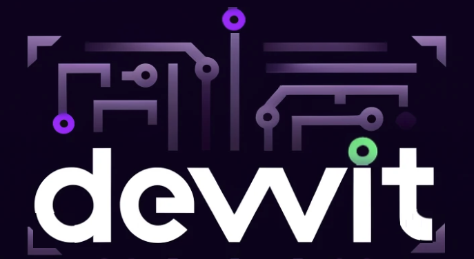
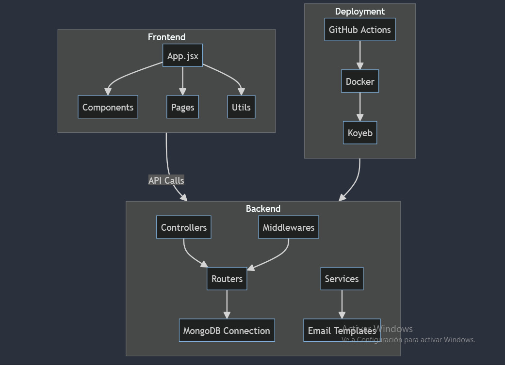
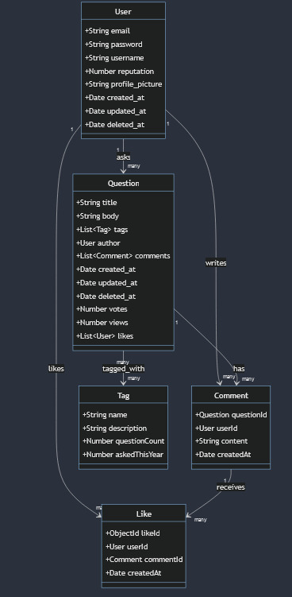

<p align="center">
  
</p>
<h2 align="center">DEVVIT, A STACKOVERFLOW CLONE</h2>
<p align="center">

<a href="https://makeapullrequest.com/">
    
  </a>
</p>
<p align="center">
		<em>Developed with the software and tools below:</em>
</p>
<p align="center">
	
	
	
	
	
	
	
	<br>
	
	
	
	
	
	
</p>
<hr>

## Quick Links

> - [Overview](#overview)
> - [Features](#features)
> - [Use Case Diagram](#use-case-diagram)
> - [Architecture Flow](#architecture-flow)
> - [Repository Structure](#repository-structure)
> - [Modules](#modules)
> - [Getting Started](#getting-started)
>   - [Installation](#installation)
>   - [Running Devvit](#running-devvit)
> - [Further Development and Improvements](#further-development-and-improvements)
> - [Contributors](#contributors)
> - [Contributing](#contributing)

---

## Overview

DEVVIT is a StackOverflow clone that provides a platform for developers to ask questions, share knowledge, and connect with the community. Users can register, log in, ask questions, write comments, and like content. The system manages user authentication, tracks likes, and updates reputations accordingly.

Our frontend is deployed using Netlify and can be accessed via [https://devvit.netlify.app/](https://devvit.netlify.app/). The backend services are hosted on Koyeb, ensuring scalability and reliability.

---

## Features

- **User Authentication**: Secure registration and login system to manage user accounts and protect user data.
- **Question and Comment Operations**: Users can create, read, and delete questions and comments.
- **Like and Unlike**: Users can like and unlike comments and questions, helping to highlight valuable contributions and manage content quality.
- **Email Notification System**: Managed by Handlebars, our email notification system sends emails to users when they sign up or when someone comments on their questions, ensuring they stay updated on important activities.
- **Reputation Management**: Tracks likes on user comments to update user reputations, encouraging active and helpful participation.


---

## Use Case Diagram

<p align="center">
  
</p>

The use case diagram illustrates the various interactions between the users and the DEVVIT system. 

- **User**: Represents any individual using the system. Users can perform various actions such as registering, logging in, posting questions, writing comments, and liking content.
- **Question**: Users can create, read, and delete questions. Each question can be tagged with relevant topics and receive comments from other users.
- **Comment**: Users can write, read, and delete comments on questions. Comments can also be liked by other users.
- **Like**: Users can like and remove likes from both questions and comments, contributing to the reputation system.
- **Tag**: Questions can be tagged with relevant keywords to facilitate easier searching and categorization.

---

## Architecture Flow

<p align="center">
  
</p>


The architecture is divided into three main sections: Frontend, Backend, and Deployment.

### Frontend
- **App.jsx**: The entry point of the frontend application, built with React. It orchestrates the rendering of various components and pages.
- **Components**: Reusable UI elements that form the building blocks of the application’s user interface.
- **Utils**: Utility functions and helpers that support the frontend operations, including API calls and local storage management.

### Backend
- **Controllers**: Handle the request and response logic for different routes. This includes managing user authentication, questions, comments, likes, and tags.
- **Middlewares**: Functions that process requests before they reach the controllers, providing functionalities like authentication checks and data validation.
- **Routers**: Define the API endpoints and map them to the corresponding controller functions.
- **Services**: Contain the business logic and interact with the database, sending and retrieving data as needed.
- **MongoDB Connection**: Manages the connection to the MongoDB database, ensuring data is stored and retrieved efficiently.
- **Email Templates**: Handlebars templates used to generate dynamic content for email notifications sent to users.

### Deployment
- **GitHub Actions**: Automates the CI/CD pipeline, running tests, and deploying the application whenever changes are pushed to the repository.
- **Docker**: Containerizes the application, ensuring it runs consistently across different environments.
- **Koyeb**: The hosting platform where the application is deployed, providing scalability and reliability.


---

##  Repository Structure

```sh
└── stackoverflow/
    ├── .github
    │   └── workflows
    │       └── prod-deployment.yaml
    ├── README.md
    ├── backend
    │   ├── .gitignore
    │   ├── Dockerfile
    │   ├── package.json
    │   └── src
    │       ├── controllers
    │       │   ├── authenticator.js
    │       │   ├── comments.js
    │       │   ├── like.js
    │       │   ├── questions.js
    │       │   ├── tags.js
    │       │   └── users.js
    │       ├── email-templates
    │       │   ├── commentemail.hbs
    │       │   └── welcome.hbs
    │       ├── index.js
    │       ├── middlewares
    │       │   ├── comments.js
    │       │   ├── questions.js
    │       │   └── users.js
    │       ├── mongo
    │       │   ├── connection
    │       │   │   └── index.js
    │       │   └── data
    │       │       └── schemas
    │       ├── routers
    │       │   ├── authenticator.js
    │       │   ├── comments.js
    │       │   ├── like.js
    │       │   ├── questions.js
    │       │   ├── tags.js
    │       │   └── users.js
    │       └── service
    │           └── email.service.js
    ├── docker-compose.yaml
    ├── emails
    │   ├── emails
    │   │   ├── commentemail.jsx
    │   │   └── welcome.jsx
    │   ├── package.json
    │   └── readme.md
    ├── frontend
    │   ├── .gitignore
    │   ├── index.html
    │   ├── package.json
    │   ├── public
    │   │   ├── _redirects
    │   │   └── assets
    │   │       ├── icons
    │   │       │   ├── close_7e3aed.svg
    │   │       │   ├── close_white.svg
    │   │       │   ├── membership.svg
    │   │       │   ├── reputation.svg
    │   │       │   └── search.svg
    │   │       └── img
    │   │           ├── hero1.png
    │   │           ├── hero2.png
    │   │           ├── hero3.png
    │   │           ├── hero4.png
    │   │           └── logo.png
    │   ├── src
    │   │   ├── App.jsx
    │   │   ├── _utils
    │   │   │   ├── api.js
    │   │   │   └── localStorage.utils.js
    │   │   ├── components
    │   │   │   ├── AuthModal
    │   │   │   │   ├── AuthModal.jsx
    │   │   │   │   └── AuthModal.module.css
    │   │   │   ├── FeaturesSection
    │   │   │   │   ├── FeaturesSection.jsx
    │   │   │   │   └── FeaturesSection.module.css
    │   │   │   ├── FilterSeachBar
    │   │   │   │   ├── FilterSearchBar.jsx
    │   │   │   │   └── FilterSearchBar.module.css
    │   │   │   ├── Footer
    │   │   │   │   ├── Footer.jsx
    │   │   │   │   └── Footer.module.css
    │   │   │   ├── Header
    │   │   │   │   ├── Header.jsx
    │   │   │   │   └── Header.module.css
    │   │   │   ├── HeroSection
    │   │   │   │   ├── HeroSection.jsx
    │   │   │   │   └── HeroSection.module.css
    │   │   │   ├── HomePage
    │   │   │   │   └── HomePage.jsx
    │   │   │   ├── InsideQuestionPage
    │   │   │   │   ├── InsideQuestionPage.jsx
    │   │   │   │   ├── InsideQuestionPage.module.css
    │   │   │   │   ├── deleteIcon.png
    │   │   │   │   ├── heart.png
    │   │   │   │   ├── photographer.png
    │   │   │   │   └── profilePic.png
    │   │   │   ├── QuestionForm
    │   │   │   │   ├── QuestionForm.jsx
    │   │   │   │   └── QuestionForm.module.css
    │   │   │   ├── QuestionPage
    │   │   │   │   ├── QuestionPage.jsx
    │   │   │   │   ├── QuestionPage.module.css
    │   │   │   │   ├── deleteIcon.png
    │   │   │   │   ├── heart.png
    │   │   │   │   └── profilePic.png
    │   │   │   ├── TagPage
    │   │   │   │   ├── TagItem
    │   │   │   │   ├── TagPage.jsx
    │   │   │   │   └── TagPage.module.css
    │   │   │   ├── UserPage
    │   │   │   │   ├── UserItem
    │   │   │   │   ├── UserPage.jsx
    │   │   │   │   └── UserPage.module.css
    │   │   │   └── UserProfilePage
    │   │   │       ├── UserProfilePage.jsx
    │   │   │       └── UserProfilePage.module.css
    │   │   ├── index.css
    │   │   └── main.jsx
    │   └── vite.config.js
    ├── package-lock.json
    ├── package.json
    └── turbo.json
```

---

## Modules

<details closed><summary>Frontend</summary>

| Technology                | Summary                                                                                 |
| ------------------------- | --------------------------------------------------------------------------------------- |
| **React**                 | Used to develop the user interface.                                                     |
| **Vite**                  | A build tool that offers a fast development experience for React projects.              |
| **React Router DOM**      | Manages navigation between different sections of the application.                       |
| **Axios**                 | Used for making HTTP requests to the backend.                      |
| **react-search-box**      | Used in the `Header.jsx` component for implementing a search box functionality.         |

</details>

<details closed><summary>Backend</summary>

| Technology                | Summary                                                                                 |
| ------------------------- | --------------------------------------------------------------------------------------- |
| **Express**               | A web application framework for Node.js that simplifies the creation of web servers.    |
| **Mongoose**              | Provides a schema-based solution for modeling application data with MongoDB.            |
| **Bcryptjs**              | Used to encrypt passwords before storing them in the database.                          |
| **JWT (jsonwebtoken)**    | Allows for secure authentication and information transmission between parties as a JSON object. |
| **Cors**                  | Enables Cross-Origin Resource Sharing in the Express server.                            |
| **Dotenv**                | Manages environment variables in the Express server.                                    |
| **Nodemon**               | Automatically restarts the Node.js server when file changes are detected during development. |
| **Handlebars**            | A templating engine that helps build semantic HTML structures with dynamic data for sending emails or generating other HTML views. |

</details>

---

## Getting Started

### Installation

Ensure you have the following dependencies installed on your system:

- **Node.js**: Visit [Node.js](https://nodejs.org/) and download the LTS version for your operating system. This installer includes npm (Node Package Manager).
- **npm**: Installed automatically with Node.js. Verify the installation by running `npm -v` in your terminal.
- **Git**: Visit [Git](https://git-scm.com/) to download the version for your operating system. Git Bash is recommended for Windows users.

### Configuration of Environment Variables

To ensure the proper functioning of your project in a local development environment, it is essential to configure environment variables. These variables facilitate secure communication with databases and external services without including sensitive information directly in the code. You will need to create `.env` files in the appropriate directories for the frontend and backend, allowing you to handle important configurations securely and flexibly.

**Backend `.env`:**

```sh
MONGO_URL=<your_mongodb_uri>
JWT_SECRET=<your_jwt_secret>
EMAIL_ADDRESS=<your_app_email_address>
EMAIL_PASSWORD=<your_app_password>
```

**Global `.env`:**

```sh
REACT_APP_BACKEND_URL=<your_backend_url>
```


### Running Devvit 

Clone the repository and install the dependencies:

```sh
git clone https://github.com/nds-fsd/stackoverflow.git
cd stackoverflow
npm install
```

Run the application
```sh
npm run dev
```
This command will start both the backend server and the frontend development server using turbo.

---

## Further Development and Improvements

- [ ] Allow editing of questions and comments
- [ ] Implement feature of voting
- [ ] Improve the inputs for tags when submitting a question
- [ ] Create a page for each tag with relevant statistics
- [ ] Implement comprehensive testing
- [ ] Refine the user reputation system to ensure more accurate and fair calculations based on user activity and contribution quality, and upvotes
- [ ] Enhance security by implementing more secure ID handling methods, such as using UUIDs or other non-sequential identifiers to prevent enumeration attacks and improve overall data security

---

## Contributors

- [Alex Bessedonato](https://github.com/alexbessedonato)
- [Viktoria Kovacs](https://github.com/kovvik23)
- [Noah Rebollar](https://github.com/NoahRebollar)
- [Sofia Simeonoff](https://github.com/SofiaSimeonoff)

---


##  Contributing

Contributions are welcome! Here are several ways you can contribute:

- **[Submit Pull Requests](https://github.com/nds-fsd/stackoverflow/pulls)**: Review open PRs, and submit your own PRs.
- **[Report Issues](https://github.com/nds-fsd/stackoverflow/issues)**: Submit bugs found or log feature requests for Stackoverflow.

<details closed>
    <summary>Contributing Guidelines</summary>

	
1. **Fork the Repository**: Start by forking the project repository to your GitHub account.
2. **Clone Locally**: Clone the forked repository to your local machine using a Git client.
   ```sh
   git clone https://github.com/nds-fsd/stackoverflow
   ```
3. **Create a New Branch**: Always work on a new branch, giving it a descriptive name.
   ```sh
   git checkout -b new-feature-x
   ```
4. **Make Your Changes**: Develop and test your changes locally.
5. **Commit Your Changes**: Commit with a clear message describing your updates.
   ```sh
   git commit -m 'Implemented new feature x.'
   ```
6. **Push to GitHub**: Push the changes to your forked repository.
   ```sh
   git push origin new-feature-x
   ```
7. **Submit a Pull Request**: Create a PR against the original project repository. Clearly describe the changes and their motivations.

Once your PR is reviewed and approved, it will be merged into the main branch.

</details>

